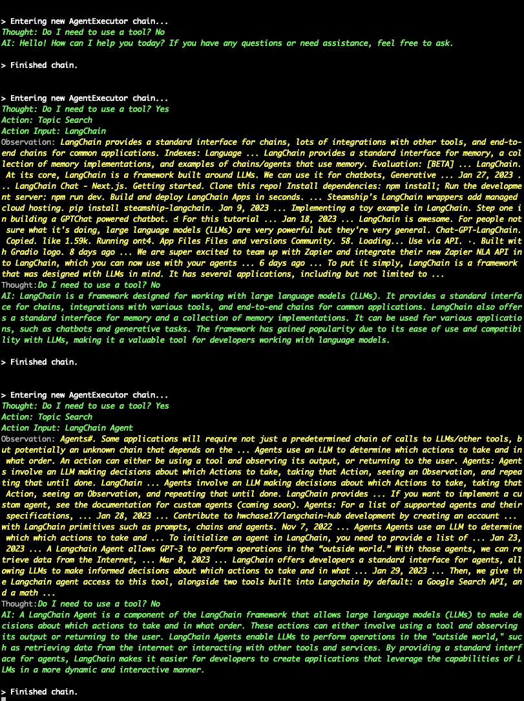

# 🚀 LiveQuery GPT-4: chatbot with GPT-4-powered convos & Google-powered real-time search

Welcome to the **LiveQuery GPT-4** project! 🎉 This is a simple chatbot powered by OpenAI's GPT-4, LangChain framework, Gradio, and Google Custom Search API. It utlizes LangChain's ReAct Agent to enable GTP-4 based chat to have access to live Google search results.

## Conversation Example
### UI

### LangChain reasoning for the same conversation


## Features & Roadmap 💡

- [x] GPT-4 powered chatbot with LangChain framework 🤖
- [x] Conversation history tracking with memory 📜
- [x] Client Supplied API Key 🔑
- [x] Google Custom Search API integration for real-time and topic-specific information 🔍
- [x] Easy-to-use Gradio interface for user interaction 👩‍💻
- [x] Customizable agent chain with integrated search tools 🛠️
- [ ] Add more tools to the agent chain
- [ ] Implement user authentication for API key management
- [ ] Integrate with popular messaging platforms

## Installation

1. Clone this repository:
```
git clone https://github.com/yourusername/gpt-4-langchain-conversational-assistant.git
```

2. Install the required packages:
```
pip install -r requirements.txt
```

3. Set up your OpenAI API key as an environment variable:
```
export OPENAI_API_KEY="your_openai_api_key"
```

4. Create a [Google Programmable Search](https://programmablesearchengine.google.com) engine and copy the ID.

5. Enable the Custom Search API in your [GCP console](https://console.cloud.google.com/apis/api/customsearch.googleapis.com),
   and create a GCP API key [here](https://console.cloud.google.com/apis/credentials).

6. Set up the `GOOGLE_CSE_ID` and `GCP_API_KEY` environment variable:
```
export GOOGLE_CSE_ID="your_google_cse_id"
export GCP_API_KEY="your_gcp_api_key"
```
## Usage

1. Run the server:
```
python run_chatbot.py
```
2. Open the Gradio interface in your web browser at http://127.0.0.1:7860

## Contributing

We would love for you to contribute to this project! 🤗 If you have any ideas, suggestions, or improvements, please feel free to submit a pull request or open an issue.